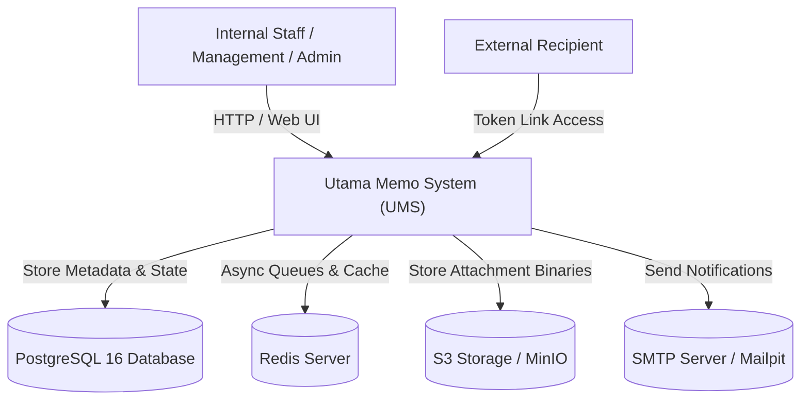
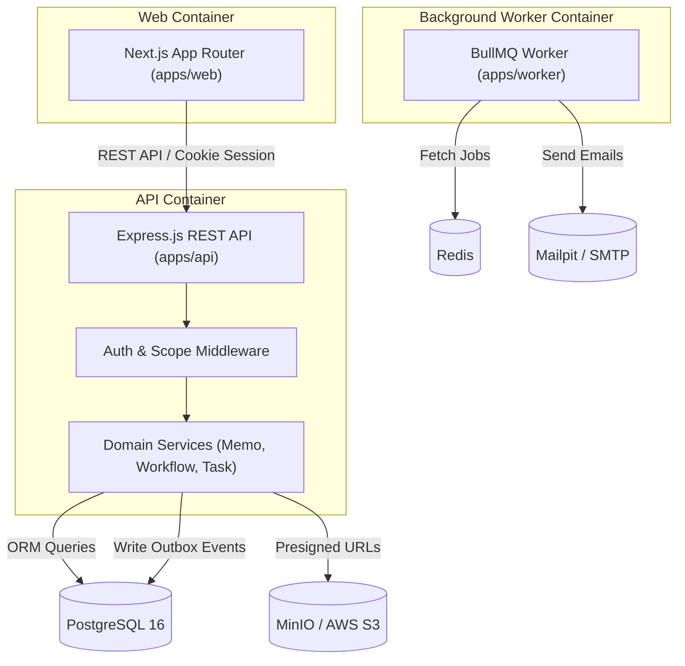
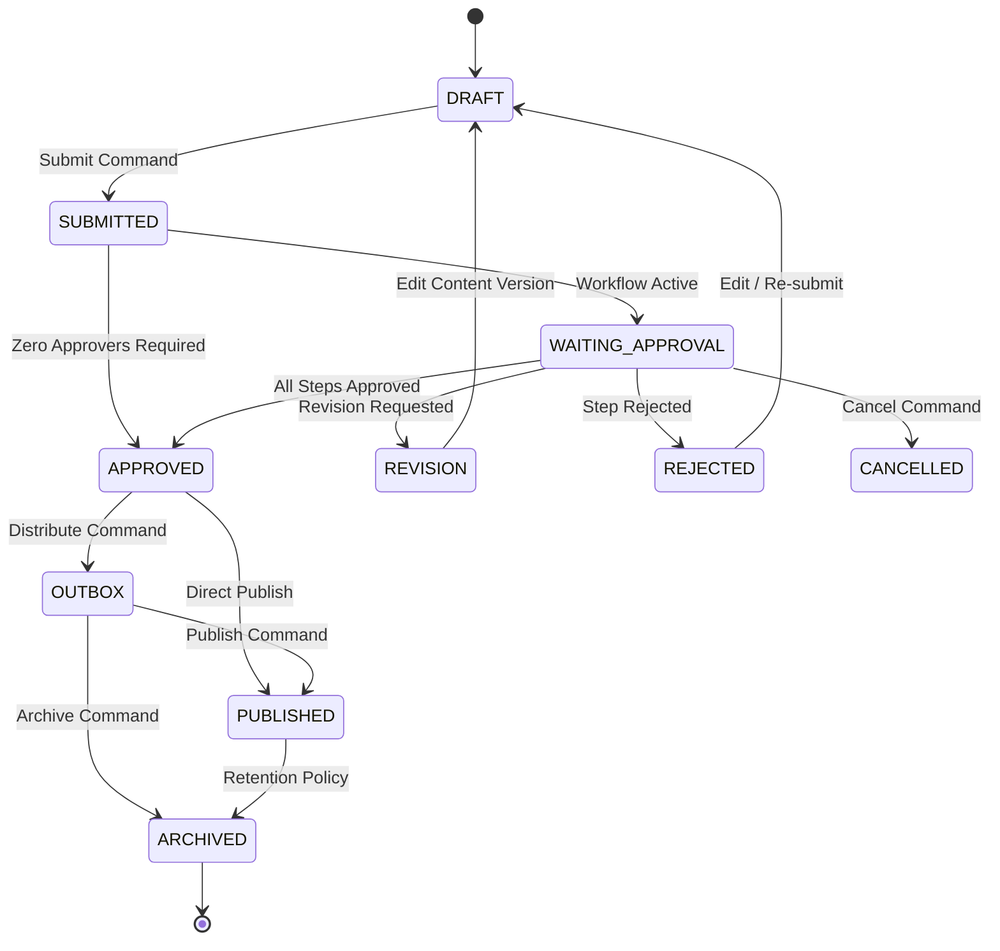
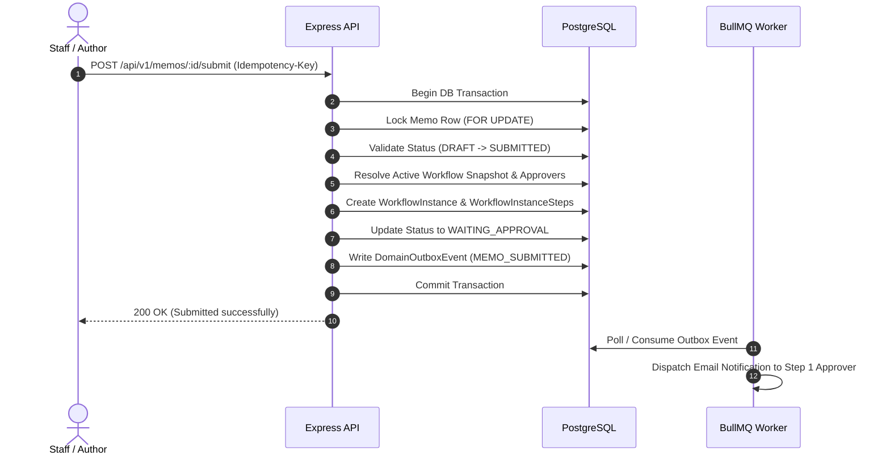
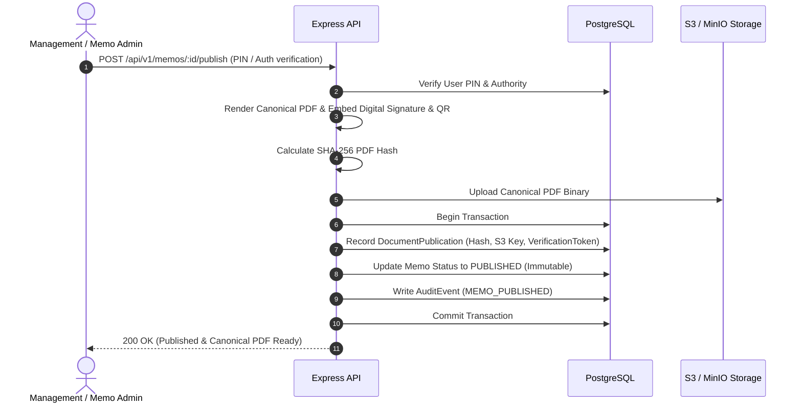
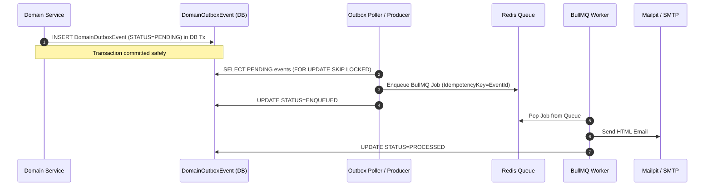

# System & Architecture Diagrams - Utama Memo System (UMS)

## 1. System Context Diagram

## 2. Container Architecture Diagram

## 3. Memo Lifecycle State Diagram

## 4. Submit & Approval Sequence Diagram

## 5. Publish Sequence Diagram

## 6. Notification Outbox Sequence Diagram

